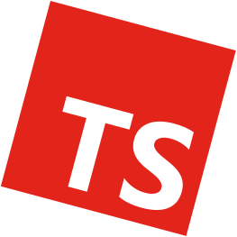

# Contributing

## Guidelines for Awesome Items

1. Relates to the use of React-lua. Includes ports to transpiled languages like Roblox Typescript.
2. Open-source, under any license in compliance with the Open Source Definition.
3. It should be functioning, with a complete or maintained status.

The goal of this list is to promote React-lua within the open-source community. As such, this list will not be opinionated. If a project meets these guidelines, it may be added to the list.

## Updating Information

Projects may receive updated descriptions, typescript ports, or other relevant information. Pull Requests or Issues are welcome for updating any information on this list, so long as it is accurate and maintains the format.

## Adding an Item

If a project meets the guidelines listed at the top of this document, it may be added to the list. Anyone may create an Issue requesting a project be added to the list, or submit a Pull Request while following the steps below.

### Choosing a Category

Which category does the item belong to?

- Articles: Blogs, Articles, and other text documents relating to React-lua.
- Examples: Games and Code Snippets which showcase the use of React-lua or any item on this list.
- Components: Individual React Components or React Component Libraries.
- Motion: Libraries and tools for animating UI elements, such as springs, tweens, etc.
- State Management: Libraries for managing state when working with React-lua, such as Redux, Reflex, or Charm.
- Hooks: Individual React Hooks or React Hook Libraries.
- Storybooks: Storybook tools, libraries, etc. such as Hoarcekat, UI Labs, or Flipbook.
- Testing: Libraries or tools which aid in testing or debugging React code.
- Other: Anything that doesn't fit in these categories.

### Updating the Table of Contents

Once you have a category selected, it's time to scroll to it and update that category's table of contents. In alphabetical order, add the link text and definition.


Example:
```diff
  ### Contents
  - [**Charm**]
+ - [**Crate**]
  - [**Reflex**]

  [**Charm**]: #charm-
+ [**Crate**]: #crate-
  [**Reflex**]: #reflex-
```

*Yes, the `-` in the definition is not a mistake and is important.*

### Creating a Section

After the Table of Contents, in alphabetical order, create a new section.
Make sure you use the same name as the link text you used in the table of contents.

Try to follow the same format as the rest of the list. Below is an example which you can use when making your section.

Example:
```md
### Project Name 

This is my description.

#### Links
- [**Documentation**](DOCS_LINK)
- [**Repository**](https://github.com/AUTHOR/PACKAGE)
- [**Documentation**](DOCS_LINK)
- [**Wally**](https://wally.run/package/AUTHOR/PACKAGE)
- [**NPM**](https://www.npmjs.com/package/@rbxts/PACKAGE)
- [**Demo Game**](https://www.roblox.com/games/ID)
```

*You may not use all of these links, and these examples may not cover everything.*

Make sure all of the information is accurate, and then you're good to submit!

## Removing an Item

Items on this list may be removed if:
- Deprecated
- Non-functioning, or incomplete and unmaintained
- Requested from author or maintainer of item

This list is non-exhaustive, other factors may be included when deciding to remove an item.

Requests or suggestions to remove items may be done through Issues, following the template.