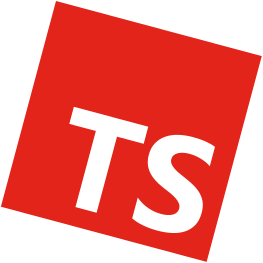

# Awesome React-Lua

A comprehensive list of awesome projects for React-Lua.

### Contents
- [**Guides**]
- [**Examples**]
- [**Components**]
- [**Motion**]
- [**State Management**]
- [**Hooks**]
- [**Storybooks**]
- [**Testing**]
- [**Other**]

[**Guides**]: #guides
[**Examples**]: #examples
[**Components**]: #components
[**Motion**]: #motion
[**State Management**]: #state-management
[**Hooks**]: #hooks
[**Storybooks**]: #storybooks
[**Testing**]: #testing
[**Other**]: #other

# React-lua

React Lua is a comprehensive translation of upstream [ReactJS](https://github.com/facebook/react) from JavaScript into Lua, and is highly-turned for both performance and correctness.

#### Links
- [**Repository**](https://github.com/jsdotlua/react-lua)
- [**Wally**](https://wally.run/package/jsdotlua/react)

## Guides

No guides here yet.

## Examples

### Contents
- [**Components**]
- [**Motion**]
- [**Hooks**]

[**Components**]: #components
[**Motion**]: #motion
[**Hooks**]: #hooks

### Roblox-Typescript Example 

A simple counter app built with **roblox-ts + React**.

#### Links
- [**Repository**](https://github.com/littensy/rbxts-react-exampl)
- [**Demo Game**](https://www.roblox.com/games/14747634789/)

## Components

### Contents
- [**FlashList-Lua**]
- [**React-Roblox Studio Plugin**]
- [**StudioComponents**]
- [**Synthetic**]
- [**VirtualizedList-Lua**]

[**FlashList-Lua**]: #flashlist-lua
[**React-Roblox Studio Plugin**]: #react-roblox-studio-plugin
[**StudioComponents**]: #studiocomponents
[**Synthetic**]: #synthetic
[**VirtualizedList-Lua**]: #virtualizedlist-lua

### FlashList-Lua 

Fast & performant React Roblox list. No more blank cells.

#### Links
- [**Repository**](https://github.com/Neura-Studios/flash-list-lua)
- [**Wally**](https://wally.run/package/neura-studios/flash-list)

### React-Roblox Studio Plugin 

A component library to create Roblox Studio plugins using react-lua.

#### Links
- [**Repository**](https://github.com/seaofvoices/react-roblox-studio-plugin)

### StudioComponents 

A collection of React implementations of Roblox Studio components such as Checkboxes, Buttons, and Dropdowns. This is intended for building plugins for Roblox Studio.

    
Screenshots

    

        
        
    

#### Links
- [**Repository**](https://github.com/sircfenner/StudioComponents)
- [**Wally**](https://wally.run/package/sircfenner/studiocomponents)

### Synthetic 

This UI library is powered by a Fusion framework variant, and has the the goal of porting the Google Material Design framework / philosophy to Roblox.

> [!IMPORTANT]
> Synthetic currently only supports Roact, see Issue [#22](https://github.com/nightcycle/synthetic/issues/22) for more information.

#### Links
- [**Repository**](https://github.com/nightcycle/synthetic)
- [**Wally - Roact**](https://wally.run/package/nightcycle/synthetic-roact)

### VirtualizedList-Lua 

A collection of virtual list components, supporting the most handy features:

- Fully cross-platform
- Optional horizontal mode
- Configurable viewability callbacks
- Header support
- Footer support
- Separator support
- Pull to Refresh
- Scroll loading
- ScrollToIndex support
- Multiple column support
- Animation support

    

        About Virtualization
    

    

        Virtualization massively improves memory consumption and performance of large lists by maintaining a finite render window of active items and replacing all items outside of the render window with appropriately sized blank space. The window adapts to scrolling behavior, and items are rendered incrementally with low-priority (after any running interaction responses) if they are far from the visible area, or with high-priority otherwise to minimize the potential of seeing blank space.
    

#### Links
- [**Repository**](https://github.com/jsdotlua/virtualized-list-lua)
- [**Wally**](https://wally.run/package/jsdotlua/virtualized-list)

## Motion

### Contents
- [**React-Otter**]
- [**React-Spring**]
- [**Ripple**]

[**React-Otter**]: #react-otter
[**React-Spring**]: #react-spring
[**Ripple**]: #ripple

### React-Otter 

[**Otter**](https://github.com/jsdotlua/otter) is a declarative animation library for Roblox Lua built around (but not limited to) springs.

React-Otter exports an interface for using Otter with React.

#### Links
- [**Repository**](https://github.com/littensy/ripple)

### React-Spring 

A modern spring-physics based animation library for Roact inspired by react-spring.

#### Links
- [**Repository**](https://github.com/chriscerie/roact-spring)
- [**Documentation**](https://www.chrisc.dev/roact-spring/)
- [**Wally**](https://wally.run/package/chriscerie/react-spring)

### Ripple 

**Ripple** is a simple, lightweight, and easy-to-use Roblox library for creating simple transitions and animations.

It is inspired by [roact-spring](https://github.com/chriscerie/roact-spring) and is primarily intended to be a general-use alternative to [Flipper](https://github.com/Reselim/Flipper) for [Roblox-TS](https://roblox-ts.com).

#### Links
- [**Repository**](https://github.com/littensy/ripple)
- [**Wally**](https://wally.run/package/littensy/ripple)
- [**NPM**](https://www.npmjs.com/package/@rbxts/ripple)

## State Management

### Contents
- [**Charm**]
- [**Reflex**]

[**Charm**]: #charm
[**Reflex**]: #reflex

### Charm 

**Charm** is an atomic state management library inspired by [Jotai](https://jotai.org) and [Nanostores](https://github.com/nanostores/nanostores).

Store your immutable state in atoms, and write intuitive functions that read, write, and subscribe to state.

#### Links
- [**Repository**](https://github.com/littensy/charm)
- [**Wally**](https://wally.run/package/littensy/charm)
- [**NPM**](https://www.npmjs.com/package/@rbxts/charm)

### Reflex 

**Reflex** is a simple state container inspired by [Rodux](https://github.com/roblox/rodux) and [Silo](https://github.com/sleitnick/rbxts-silo), designed to be an all-in-one solution for managing and reacting to state in Roblox games.

You can use Reflex with Roact on the client with [`@rbxts/roact-reflex`](https://npmjs.com/package/@rbxts/roact-reflex), or use it to manage your game's state on the server.

#### Links
- [**Repository**](https://github.com/littensy/reflex)
- [**Documentation**](https://littensy.github.io/reflex/)
- [**Wally**](https://wally.run/package/littensy/reflex)
- [**NPM**](https://www.npmjs.com/package/@rbxts/reflex)

## Hooks

### Contents
- [**Hooks (howmanysmall)**]
- [**Pretty React Hooks**]
- [**React-Lua Hooks**]
- [**React-Redux**]
- [**Pretty React Hooks**]

[**Hooks (howmanysmall)**]: #hooks-howmanysmall-
[**Pretty React Hooks**]: #pretty-react-hooks
[**React-Lua Hooks**]: #react-lua-hooks
[**React-Redux**]: #react-redux
[**React-Reflex**]: #react-reflex

### Hooks (howmanysmall) 
 
A large collection of hooks for React by howmanysmall.

#### Links
- [**Repository**](https://github.com/howmanysmall/Hooks)
- [**Documentation**](https://howmanysmall.github.io/Hooks/)
- [**Wally**](https://wally.run/package/howmanysmall/hooks)

### Pretty React Hooks 

An opinionated collection of useful hooks and utilites for [React](https://github.com/littensy/rbxts-react) in [roblox-ts](https://roblox-ts.com).

Includes hooks like `useMotor`, `useAsync`, and `useTagged`.

#### Links
- [**Repository**](https://github.com/littensy/pretty-react-hooks)
- [**NPM**](https://www.npmjs.com/package/@rbxts/pretty-react-hooks)

### React-Lua Hooks 

React-Lua Hooks consists of three main packages that revolves around [react-lua](https://github.com/jsdotlua/react-lua) hooks:

- [Lua hooks](packages/react-lua-hooks/README.md#content): general-purpose collection of hooks for [react-lua](https://github.com/jsdotlua/react-lua)
- [Roblox hooks](packages/react-roblox-hooks/README.md#content): hooks specifically made for Roblox development
- [react-render-hook](packages/react-render-hook/README.md#content): a utility function to quickly test React hooks

#### Links
- [**Repository**](https://github.com/seaofvoices/react-lua-hooks)

### React-Redux 

Hooks for using Rodux with React-Lua.

#### Links
- [**Repository**](https://github.com/chriscerie/react-redux)
- [**Wally**](https://wally.run/package/chriscerie/react-redux)

### React-Reflex 

**Reflex** is a simple state container inspired by [Rodux](https://github.com/roblox/rodux) and [Silo](https://github.com/sleitnick/rbxts-silo), designed to be an all-in-one solution for managing and reacting to state in Roblox games.

**React Reflex** provides React hooks and components for Reflex using either [`@rbxts/react`](https://github.com/littensy/rbxts-react) or [`jsdotlua/react`](https://github.com/jsdotlua/react-lua).

#### Links
- [**Repository**](https://github.com/littensy/react-reflex)
- [**Documentation**](https://littensy.github.io/reflex/docs/guides/roact-reflex/)
- [**Wally**](https://wally.run/package/littensy/react-reflex)
- [**NPM**](https://www.npmjs.com/package/@rbxts/react-reflex)

## Storybooks

### Contents

- [**Flipbook**]
- [**UI Labs**]

[**Flipbook**]: #flipbook
[**UI Labs**]: #ui-labs

### Flipbook

flipbook is a storybook plugin that previews UI components in a sandboxed environment.

With it you can isolate distinct parts of your game's UI to hammer out edge cases and complex states without having to run through the whole UI.

    
Screenshot

    

#### Links
- [**Repository**](https://github.com/flipbook-labs/flipbook)
- [**Documentation**](https://flipbook-labs.github.io/flipbook)
- [**GitHub Release**](https://github.com/flipbook-labs/flipbook/releases/latest)
- [**Creator Marketplace**](https://create.roblox.com/store/asset/8517129161/flipbook)

### Hoarcekat

Hoarcekat is a [Storybook-like](https://storybook.js.org/) plugin that makes it easy to preview individual UI elements.

Developers write "stories" that explain how their UI should be previewed. It runs without any knowledge of the rest of your application, meaning you can use it to easily create and preview your UI as isolated components. Because of this, it is especially useful when using [Roact](https://roblox.github.io/roact/), though Roact is not required.

#### Links
- [**Repository**](https://github.com/Kampfkarren/hoarcekat)
- [**GitHub Release**](https://github.com/Kampfkarren/hoarcekat/releases/latest)
- [**Creator Marketplace**](https://www.roblox.com/library/4621580428/Hoarcekat)

### UI Labs

UI Labs is a Storybook-like plugin for roblox that allows you to visualize stories in real-time without needing to run your code.

    
Screenshot

    

#### Links
- [**Repository**](https://github.com/PepeElToro41/ui-labs)
- [**Documentation**](https://pepeeltoro41.github.io/ui-labs/)
- [**GitHub Release**](https://github.com/PepeElToro41/ui-labs/releases/latest)
- [**Creator Marketplace**](https://create.roblox.com/store/asset/14293316215/UI-Labs)

## Testing

### React Testing Library 

Simple and complete testing utilities that encourage good testing practices.

#### Links
- [**Repository**](https://github.com/jsdotlua/react-testing-library-lua)

## Other

### Contents
- [**Pumpkin**]
- [**React-Error-Boundary**]
- [**Rbxts-React**]
- [**React-lua Plus**]
- [**React-Matter**]
- [**React-Tree**]

[**Pumpkin**]: #pumpkin
[**React-Error-Boundary**]: #react-error-boundary
[**Rbxts-React**]: #react-for-roblox-typescript
[**React-lua Plus**]: #react-lua-plus
[**React-Matter**]: #react-matter
[**React-Tree**]: #react-tree

### Pumpkin 

An ergonomic and powerful react-lua abstraction for Roblox.

Pumpkin is a UI library that wraps Roact and Flipper to achieve better expressiveness and ease of writing components.

#### Links
- [**Repository**](https://github.com/NightLapse-Studios/Pumpkin)

### React-Error-Boundary 

A robust error boundary library for React-Lua.

    
Why react-error-boundary

    

        By design, React unmounts the entire tree when it encounters an unhandled error. This leaves the application in an ususable state unless the user refreshes the application. In the context of a video game, the player would need to leave and rejoin the game. Error boundaries provide a way to recover from errors to greatly improve user experience.
    

#### Links
- [**Repository**](https://github.com/littensy/rbxts-react)
- [**NPM**](https://npmjs.com/package/@rbxts/react)

### React for Roblox Typescript 

TypeScript type definitions for [React Lua](https://github.com/jsdotlua/react-lua) and [roblox-ts](https://roblox-ts.com), sourced from the official React types. Currently, only [`@rbxts/react`](https://npmjs.com/package/@rbxts/react) and
[`@rbxts/react-roblox`](https://npmjs.com/package/@rbxts/react-roblox) may be installed.

#### Links
- [**Repository**](https://github.com/littensy/rbxts-react)
- [**NPM**](https://npmjs.com/package/@rbxts/react)

### React-lua Plus 

A lune script that setups `react-lua` with some additional features, such as:

- Simple to setup and use
- Intellisense for React createElement (but in alternative way called Element)
- (wip) Event listening and children in props
- (wip) Server-Sided Rendering (SSR) support for Roblox

#### Links
- [**Repository**](https://github.com/jiwonz/react-lua-plus)

### React-Matter 

**React-Matter** is an interface between _[React]_ and _[Matter]_.

It provides access to useful hooks not included in with Matter.

[react]: https://jsdotlua.github.io/react-lua/
[matter]: https://matter-ecs.github.io/matter/

#### Links
- [**Repository**](https://github.com/matter-ecs/react-matter)
- [**Documentation**](https://matter-ecs.github.io/react-matter/)

### React-Tree 

A way to mount your components in the same style as Roact.

#### Links
- [**Repository**](https://github.com/howmanysmall/ReactTree)
- [**Wally**](https://wally.run/package/howmanysmall/react-tree)
